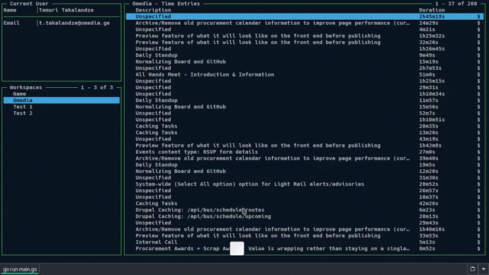

# goclockify

<div align="center">


A terminal based client for Clockify time tracker

[](https://snapcraft.io/goclockify)
[](https://github.com/ABGEO/goclockify/releases)
[](https://github.com/ABGEO/goclockify/blob/1.x/LICENSE)


</div>

## Installation

### Binary installation

[Download](https://github.com/ABGEO/goclockify/releases) a compatible binary for your system and rename it to 
`goclockify`. Then move `goclockify` into your `$PATH` somewhere (e.g. `/usr/local/bin`).

```bash
$ mv goclockify /usr/local/bin
```

Also, from this page, you can download `.deb` and `.rpm` packages and install them using your package manager:

```bash
# dpkg
$ sudo dpkg -i /path/to/goclockify.deb
$ sudo apt-get install -f

# apt
$ sudo apt install /path/to/goclockify.deb

# rpm
$ sudo rpm –i /path/to/goclockify.rpm

# yum
$ sudo yum localinstall /path/to/goclockify.rpm

# dnf
$ sudo dnf localinstall /path/to/goclockify.rpm

# ...
```

### Via Go

You can also get `goclockify` via Go:

**Note**: Go 1.14+ required.

```bash
$ go get -u github.com/abgeo/goclockify
$ cd $GOPATH/src/github.com/abgeo/goclockify
$ go install .
```

### Using Snap

`goclockify` is also available on Snap: https://snapcraft.io/goclockify

```bash
$ snap install goclockify
```

## Setup

1. Create a Clockify [API Key](https://clockify.me/user/settings);

1. Running `goclockify` for the first time, will create a default config file at `~/.config/abgeo/goclockify/config`;  
**Note**: The path to the config file will be different if you install `goclockify` using Snap. 
Check the error message (`Config file: ...`).

    ```bash
    $ goclockify
    ```

1. Update the config file and set your `clockify_api_token`:

    ```json
    {
        "clockify_api_token": "your_api_key"
    }
    ```

## Usage

## Changelog

Please see [CHANGELOG](CHANGELOG.md) for details.

## Contributing

Pull requests are welcome. For major changes, please open an issue first to discuss what you would like to change.

Please make sure to update tests as appropriate.

## Authors

- [**Temuri Takalandze**](https://abgeo.dev) - *Initial work*

## License

Copyright © 2020 [Temuri Takalandze](https://abgeo.dev).  
Released under the [MIT](LICENSE) license.
